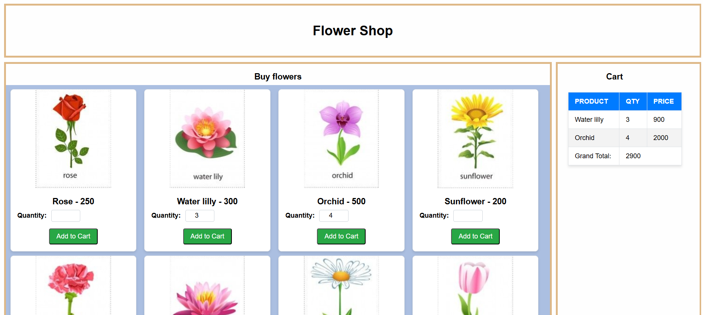

<h1>2020/ICT/30</h1>
<h2>ICAE 1</h2>

Description

In this icae I using prop parsing method for passwing flower data and quantity. first parsing flower data into product and obtain specified flower data and quantity from child component 
  to parent and it parsing to Cart component again

useState react hook using for store flower data and quantity ,onClick using handle the button click and onchange is use for handle the input data

<h2>Output</h2>

